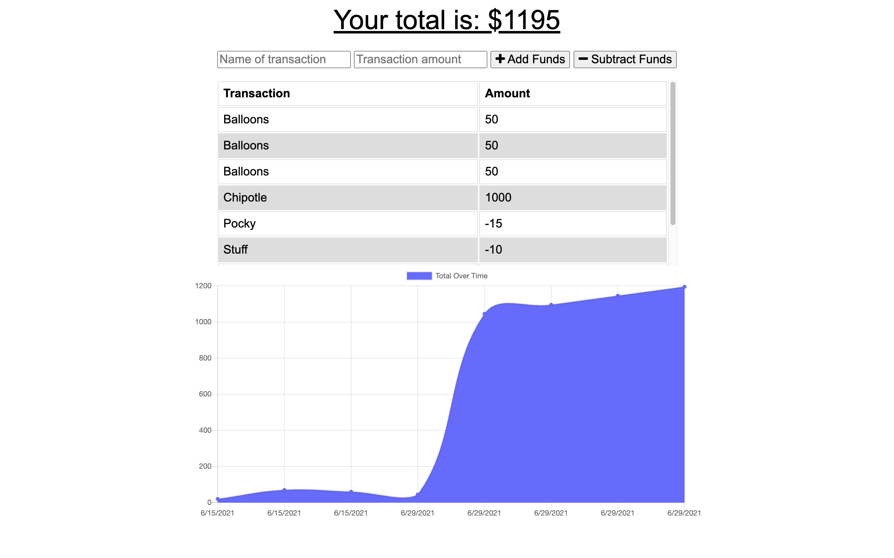

# Track Your Budget
  
  ## License
  

  ## Description
  AS AN avid traveller
I WANT to be able to track my withdrawals and deposits with or without a data/internet connection
SO THAT my account balance is accurate when I am traveling

  ## Table of Contents
  - [Description](#description)
  - [Installation](#installation)
  - [Usage](#usage)
  - [License](#license)
  - [Contributing](#contributing)
  - [Tests](#tests)
  - [Questions](#questions)

  ## Installation
  npm install

  ## Usage
  This app is used to track your spending. You can add funds or subtract funds and the result is displayed on a graph. You can start the app with npm start.

  ## License
  MIT
  
  ## Contributing
  Beau Fortier

  ## Tests
  No tests were involved

  ## Questions
  Email me for any questions.
  
  GitHub: [beau4ta](https://github.com/beau4ta)
  
  Email me with any questions: beaufortier13@gmail.com

  Link to the deployed application: https://morning-shelf-90642.herokuapp.com/

  
  